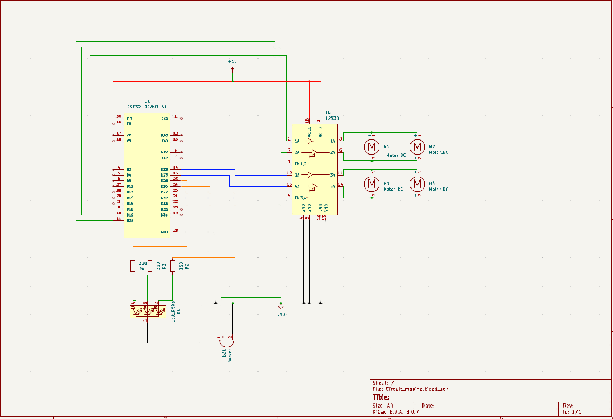
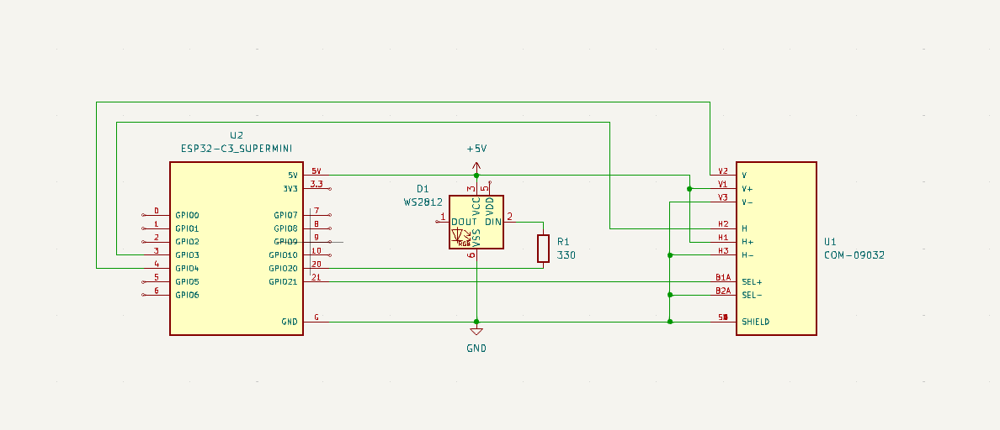

# Car and Controller Using ESP32

## Introduction

&nbsp;&nbsp; My project is a car controlled wirelessly with a controller. The primary function of the components is to connect with each other so that the operator can move the car forward and backward, steer, and honk.  
&nbsp;&nbsp; The initial idea was to learn how to control a motorized object wirelessly, creating a foundation for future projects such as an electric bike or skateboard. The project needed to remain plausible given the time constraints, so more complex ideas were discarded.  
&nbsp;&nbsp; I believe this project can serve as a good learning example and an application of basic principles relevant to the transportation industry.

## General Description

.png)

## Hardware Design

### Physical Components

#### Controller:
- **ESP32-C3 SuperMini**: The microcontroller board for the controller, chosen for its small profile. It reads the input and sends it wirelessly to the car.
- **Joystick module**: Generates input data based on the operator's actions.
- **WS2812 LED**: Indicates the state of the controller board.
- **1x 330-ohm resistor**: Used for current limiting.
- **Small Breadboard**: Facilitates the easy wiring of the components.

#### Car:
- **ESP32 Devkit V1**: The microcontroller board for the car. It receives input from the controller and instructs the actuators on what to do.
- **RGB LED**: Indicates the state of the car board.
- **Breadboard**: Facilitates the easy wiring of the components.
- **4x Small DC Motors**: The primary actuators that move the car.
- **L293D**: The H-bridge driver that helps the car board control the motors and protects it from high currents.
- **Passive Buzzer**: Represents the horn.
- **2x 4-Battery Pack**: Power source for the car.
- **4x 330-ohm resistors**: Used for current limiting.

### Electronic Schematics

#### Car:

#### Controller:

## Software Design

### Development Environment

**IDE**: PlatformIO

#### ESP32-C3 SuperMini Environment:
TO DO

#### ESP32 Devkit V1 Environment:
TO DO

## Results Obtained

TO DO

## Conclusions

TO DO

## Bibliography/Resources

### Hardware

**ESP32-C3 SuperMini**:  
- [ESP32-C3 SuperMini Datasheet](https://dl.artronshop.co.th/ESP32-C3%20SuperMini%20datasheet.pdf)  
- [ESP32-C3 Datasheet](https://www.espressif.com/sites/default/files/documentation/esp32-c3_datasheet_en.pdf)  

**ESP32 Devkit V1**:  
- [ESP32 Pinout Reference](https://lastminuteengineers.com/esp32-pinout-reference/)  
- [ESP32 Datasheet](https://www.espressif.com/sites/default/files/documentation/esp32_datasheet_en.pdf)  

**WS2812 LED**:  
- [WS2812 Datasheet](https://cdn-shop.adafruit.com/datasheets/WS2812.pdf)  
- [ESP32 WS2812 Tutorial](https://lastminuteengineers.com/esp32-wled-tutorial/)  

**L293D H-Bridge Driver**:  
- [L293D Motor Driver Tutorial](https://lastminuteengineers.com/l293d-dc-motor-arduino-tutorial/)  
- [L293 Datasheet](https://www.ti.com/lit/ds/symlink/l293.pdf)  

**Passive Buzzer**:  
- [Passive vs Active Buzzer](https://deepbluembedded.com/active-buzzer-vs-passive-buzzer/)  

### Software

**IDE**:  
- [PlatformIO](https://platformio.org/)

