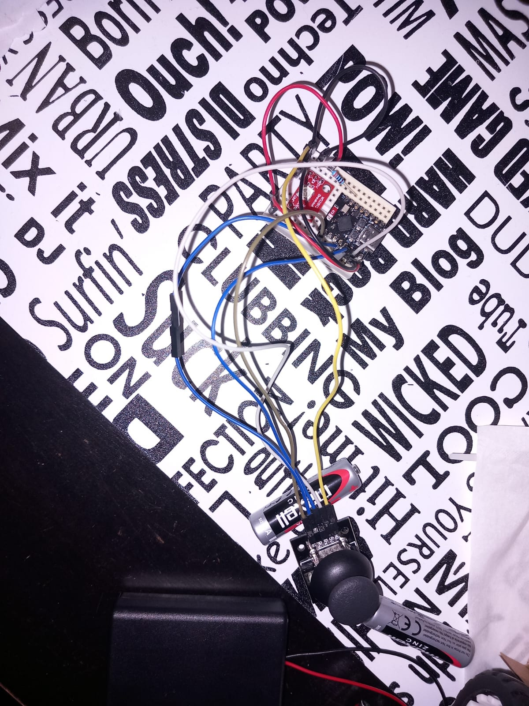

# Car and Controller Using ESP32

## Introduction

My project is a wirelessly controlled car operated via a custom-built controller. The system enables the operator to move the car forward, backward, steer, and honk.  

### What Does the Project Do?  
The car and controller communicate wirelessly, allowing essential functions such as directional movement, steering, and honking.  

### What Was the Initial Idea?  
The project was inspired by the goal of learning how to control a motorized object wirelessly, laying a foundation for future projects   
like an electric bike or skateboard. To keep it achievable within time constraints, the design was kept simple and focused.  

### Why Is It Useful?  
This project serves as a practical example of wireless control systems, offering learning opportunities for students and hobbyists.   
It bridges theory and real-world application while fostering skills in robotics and transportation technologies.  
For us, it has been a stepping stone toward more advanced projects and a valuable hands-on experience.

## General Description


## Hardware Design

### Project State

At this point, all the components of the project are connected and mounted on the chassis for the car. The boards can be programmed, and the joystick can be read through the serial port on the controller. The design of the car chassis needs to be updated to ensure that all wheels make contact with the floor.

### Bill Of Materials

#### Controller:
| Name |  Image | Number | Links |
| ----------- | ----------- |----------- | ----------- |
| ESP32-C3 SuperMini |  | 1 | [Shop](https://shorturl.at/NS3Yj)<br />[Board Datasheet](https://dl.artronshop.co.th/ESP32-C3%20SuperMini%20datasheet.pdf)<br /> [Chip Datasheet](https://www.espressif.com/sites/default/files/documentation/esp32-c3_datasheet_en.pdf)   |
| Joystick Module |  | 1 |  |
| WS2812 LED |  | 1 | [Datasheet](https://cdn-shop.adafruit.com/datasheets/WS2812.pdf)  |
| 330-ohm Resistor |  | 1 |  |
| Small Breadboard |  | 1 |  |

#### Car:
| Name | Image | Number | Links |
| ----------- | ----------- |----------- | ----------- |
| ESP32 Devkit V1 |  | 1 | [Chip Datasheet](https://www.espressif.com/sites/default/files/documentation/esp32_datasheet_en.pdf)<br >[Pinout Reference](https://lastminuteengineers.com/esp32-pinout-reference/)    |
| RGB LED |  | 1 |  |
| Breadboard |  | 2 |  |
| Small DC Motors |  | 4 |  |
| L293D |  | 1 | [Datasheet](https://www.ti.com/lit/ds/symlink/l293.pdf) |
| Passive Buzzer |  | 1 |  |
| 330-ohm Resistor |  | 3 |  |
| 4-Battery Holder |  | 1 |  |
| 9V Battery Clip |  | 1 |  |

### Physical Components

#### Controller:
- **ESP32-C3 SuperMini**:  
  - The microcontroller board for the controller, chosen for its small profile. It reads input and sends it wirelessly to the car.
  - The USB-C port is used to supply power to the board.
  - The 3.3V pin powers the joystick.
  - GPIO 3 and 4 read the analog inputs from the joystick's X and Y axes.
  - GPIO 0 reads the joystick button.
  - GPIO 21 controls the WS2812 LED. 
- **Joystick Module**:
  - Generates input data based on the operator's actions.
  - The 5V pin powers the joystick with 3.3V (we use 3.3V because the ESP32-C3 SuperMini uses 3.3V logic; using 5V would distort the axis values).
  - URx and URy send the data for the X and Y axes.
  - SW outputs data from the module's button.
- **WS2812 LED**:
  - Indicates the state of the controller board.
  - The 5V and GND pins power the LED.
  - The DI (data in) pin transmits data to the internal microcontroller. Connect this pin via a 330-ohm resistor for protection.

#### Car:
- **ESP32 Devkit V1**:
  - The microcontroller board for the car. It receives input from the controller and instructs the actuators.
  - Vin and GND power the board.
  - GPIO 23, 24, and 25 control the RGB LED, connected via 220-ohm resistors for protection.
  - GPIO 22 controls the buzzer using PWM.
  - GPIO 9, 10, 14, and 15 switch the GND and VIN for the motors on the left and right sides of the car, respectively.
  - GPIO 11 and 21 control the speed of the left and right motors with PWM signals.
- **RGB LED**:
  - Indicates the state of the car board.
  - It has three anodes and one cathode.
- **L293D**:
  - An H-bridge driver that controls the motors and protects the board from high currents.
  - Loses approximately 1V in operation.
  - Supports input voltages between 4.5V and 36V.
  - VCC1/VSS powers the logic circuit.
  - VS/VCC2 powers the motors.
  - IN1/A, IN2/A, IN3/A, and IN4/A determine the OUT pins' states, defining which pins provide VCC or GND for the motors. Both pins in a pair should not be high simultaneously.
  - ENA/EN1,2 and ENB/EN3,4 are controlled by PWM pins to regulate motor power.
  - OUT1/Y, OUT2/Y, OUT3/Y, and OUT4/Y connect to the motors; depending on other pins, one in each pair acts as GND or VCC, with variable power.
- **Passive Buzzer**:
  - Represents the horn.
  - The "+" pin is the input controlled via PWM and serves as the power source.
- **4x Small DC Motors**:
  - The primary actuators for moving the car.

### Electronic Schematics

#### Car:


#### Controller:


#### Images and prove that a component works:


[](https://www.youtube.com/watch?v=ZaIzt3UZlsc "Joystick calibration")

## Software Design

At this point in the project (milestone 3), the car and controller can communicate via Bluetooth Low Energy. The car moves, although not very effectively, due to the chassis design, which does not allow all the wheels to make proper contact with the ground. The horn and LEDs work fine, indicating whether the controller and car are connected or not.  
Overall, the project achieves its basic goals, and only minor fixes remain.

### Development Environment

**IDE**: Arduino IDE

### Libraries:
- **Bluetooth Low Energy (BLE)**: ESP32 BLE for Arduino, available in the Arduino-ESP32 library. I chose this library because there are many examples and tutorials available, and even the ESP32 SuperMini datasheet recommends using this library for BLE. Additionally, it provides an easier way to use BLE through classes, compared to building everything from scratch using the ESP-IDF.
- **LED Strips (WS2812 LED)**: FastLED. This library is very popular, with many examples and materials available. It also supports the WS2812 LED module used in this project.

### New Elements in the Project:

- The first and most interesting element for me is Bluetooth Low Energy (BLE). BLE is a Bluetooth technology introduced in 2010 with Bluetooth 4.0. It divides the band into 40 channels with a spacing of 2 MHz, compared to classic Bluetooth, which divides the band into 79 channels with a spacing of 1 MHz.
- LED strip control via the RX pin. It is fascinating to see how we can control a series of RGB LEDs with just four pins (VCC, GND, DI, DO) to produce different color patterns.
- Controlling motors can range from very simple to highly complex, depending on requirements. It involves different inputs, external microcontrollers, and gear ratios to achieve the desired results.

### Lab Functionalities:

The various functionalities learned in the lab that were applied to the project include:
- PWM for controlling different components of the car, such as the buzzer.
- ADC for reading analog values from the controller.
- Communication protocols that enable the two microcontrollers to connect and control different modules.
- UART for debugging purposes.

### Functions and Code:

This is a function to control the RGB LED, designed to make setting colors easier:

```cpp
void ledRgbSet(bool red, bool green, bool blue) {
    digitalWrite(LED_RGB_R, red);
    digitalWrite(LED_RGB_G, green);
    digitalWrite(LED_RGB_B, blue);
}
```

A simple function to control the buzzer when a button is pressed:

```cpp
void hornActivate(int btnPressed) {
    if (!btnPressed) {
        tone(BUZZER, 400);
    } else {
        noTone(BUZZER);
    }
}
```

The following function controls the wheels by sending data to three pins for each side of the car. It calculates the speed to send to the motors (negative speeds indicate backward movement) based on the input. Depending on the speed of each side's motors, it determines the direction of rotation and speed. When the controller is idle (data is in the dead zone), the motors are turned off.

```cpp
void wheelControl(int inpXaxes, int inpYaxes) {
    int speedRight = 0;
    int speedLeft = 0;

    // Forward Movement
    if (inpXaxes <= X_DEADZONE_MIN) {
        int speed = map(inpXaxes, X_DEADZONE_MIN, AXIS_MIN, MIN_SPEED, MAX_SPEED);
        speedRight = speed;
        speedLeft = speed;

        // Adjust for Turning
        if (inpYaxes <= Y_DEADZONE_MIN) { // Turning Right
            int turnFactor = map(inpYaxes, Y_DEADZONE_MIN, AXIS_MIN, MIN_SPEED, MAX_SPEED);
            speedLeft = speed;
            speedRight = speed - turnFactor;
        } else if (inpYaxes >= Y_DEADZONE_MAX) { // Turning Left
            int turnFactor = map(inpYaxes, Y_DEADZONE_MAX, AXIS_MAX, MIN_SPEED, MAX_SPEED);
            speedRight = speed;
            speedLeft = speed - turnFactor;
        }
    }

    // Backward Movement
    if (inpXaxes >= X_DEADZONE_MAX) {
        int speed = map(inpXaxes, X_DEADZONE_MAX, AXIS_MAX, MIN_SPEED, MAX_SPEED);
        speedRight = -speed;
        speedLeft = -speed;

        // Adjust for Turning
        if (inpYaxes <= Y_DEADZONE_MIN) { // Turning Right
            int turnFactor = map(inpYaxes, Y_DEADZONE_MIN, AXIS_MIN, MIN_SPEED, MAX_SPEED);
            speedLeft = -speed;
            speedRight = -(speed - turnFactor);
        } else if (inpYaxes >= Y_DEADZONE_MAX) { // Turning Left
            int turnFactor = map(inpYaxes, Y_DEADZONE_MAX, AXIS_MAX, MIN_SPEED, MAX_SPEED);
            speedRight = -speed;
            speedLeft = -(speed - turnFactor);
        }
    }

    // Apply Speed to Right Wheels
    if (speedRight >= 0) {
        digitalWrite(R_WHEELS_AHEAD, 1);
        digitalWrite(R_WHEELS_BACK, 0);
        analogWrite(R_WHEELS_SPEED, speedRight);
    } else {
        digitalWrite(R_WHEELS_AHEAD, 0);
        digitalWrite(R_WHEELS_BACK, 1);
        analogWrite(R_WHEELS_SPEED, -speedRight);
    }

    // Apply Speed to Left Wheels
    if (speedLeft >= 0) {
        digitalWrite(L_WHEELS_AHEAD, 1);
        digitalWrite(L_WHEELS_BACK, 0);
        analogWrite(L_WHEELS_SPEED, speedLeft);
    } else {
        digitalWrite(L_WHEELS_AHEAD, 0);
        digitalWrite(L_WHEELS_BACK, 1);
        analogWrite(L_WHEELS_SPEED, -speedLeft);
    }

    // Dead Zone Handling
    if (inpXaxes > X_DEADZONE_MIN && inpXaxes < X_DEADZONE_MAX && inpYaxes > Y_DEADZONE_MIN && inpYaxes < Y_DEADZONE_MAX) {
        digitalWrite(R_WHEELS_AHEAD, 0);
        digitalWrite(R_WHEELS_BACK, 0);
        analogWrite(R_WHEELS_SPEED, MIN_SPEED);
        digitalWrite(L_WHEELS_AHEAD, 0);
        digitalWrite(L_WHEELS_BACK, 0);
        analogWrite(L_WHEELS_SPEED, MIN_SPEED);
    }
}
```

The BLE functionality was implemented using the ESP32 BLE for Arduino library. The code is based on examples from the library's GitHub repository. I customized the `onConnect()` and `onDisconnect()` methods to update a variable tracking the connection status. I also created a custom service with three characteristics, each assigned a random UUID generated using this [UUID generator](https://www.uuidgenerator.net/).  
In this setup, the car is the server, advertising its service and requesting the right data, while the controller acts as the client, searching for the server's service UUID and transmitting the data needed for car operation.

### Video:
[](https://www.youtube.com/watch?v=Zph5Vruc8oc)

### Calibrations

I calibrated the joystick using the serial monitor, observing the dead zones for the X and Y axes and their respective maximum and minimum values.  
These values were noted and used to define joystick parameters, considering some tolerances.

## Conclusions

In conclusion, the project works but is hindered by weak hardware connections and a flawed 3D design. Despite this, I have learned a lot about different aspects of this field, and I am determined to improve on the weaknesses identified in this project. I look forward to future projects where I can put what I’ve learned to good use.


## Bibliography/Resources

### Hardware

**3D Modeling**:  
- [Onshape](https://www.onshape.com/en/)

**ESP32-C3 SuperMini**:  
- [ESP32-C3 SuperMini Datasheet](https://dl.artronshop.co.th/ESP32-C3%20SuperMini%20datasheet.pdf)  
- [ESP32-C3 Datasheet](https://www.espressif.com/sites/default/files/documentation/esp32-c3_datasheet_en.pdf)  

**ESP32 Devkit V1**:  
- [ESP32 Pinout Reference](https://lastminuteengineers.com/esp32-pinout-reference/)  
- [ESP32 Datasheet](https://www.espressif.com/sites/default/files/documentation/esp32_datasheet_en.pdf)  

**WS2812 LED**:  
- [WS2812 Datasheet](https://cdn-shop.adafruit.com/datasheets/WS2812.pdf)  
- [ESP32 WS2812 Tutorial](https://lastminuteengineers.com/esp32-wled-tutorial/)  

**L293D H-Bridge Driver**:  
- [L293D Motor Driver Tutorial](https://lastminuteengineers.com/l293d-dc-motor-arduino-tutorial/)  
- [L293D Datasheet](https://www.ti.com/lit/ds/symlink/l293.pdf)  

**Passive Buzzer**:  
- [Passive Active Buzzer](https://deepbluembedded.com/arduino-active-passive-buzzer/)  

### Software

**IDE**:  
- [Arduino IDE](https://www.arduino.cc/en/software)

**Bluetooth Low Energy(BLE)**:  
- [BLE materials+examples](https://dronebotworkshop.com/esp32-bluetooth/)
- [BLE materials+examples](https://github.com/mo-thunderz)
- [BLE libraries](https://github.com/espressif/arduino-esp32/tree/master/libraries/BLE)
- [UUID generator](https://www.uuidgenerator.net/)

**FastLED**:
- [materials+examples](https://racheldebarros.com/arduino-projects/how-to-use-fastled-with-arduino-to-program-led-strips/)
- [Librarie + examples](https://github.com/FastLED/FastLED?utm_source=platformio&utm_medium=piohome)


