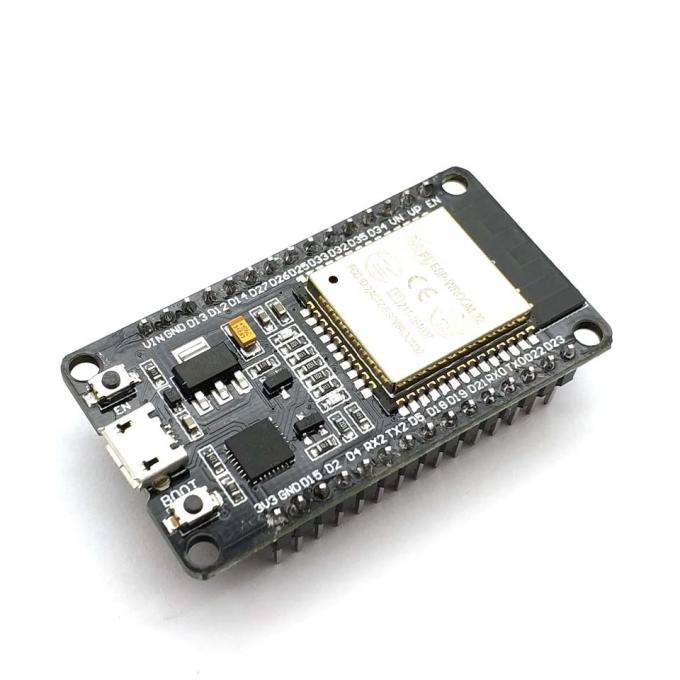

# Car and Controller Using ESP32

## Introduction

My project is a wirelessly controlled car operated via a custom-built controller. The system enables the operator to move the car forward, backward, steer, and honk.  

### What Does the Project Do?  
The car and controller communicate wirelessly, allowing essential functions such as directional movement, steering, and honking.  

### What Was the Initial Idea?  
The project was inspired by the goal of learning how to control a motorized object wirelessly, laying a foundation for future projects   
like an electric bike or skateboard. To keep it achievable within time constraints, the design was kept simple and focused.  

### Why Is It Useful?  
This project serves as a practical example of wireless control systems, offering learning opportunities for students and hobbyists.   
It bridges theory and real-world application while fostering skills in robotics and transportation technologies.  
For us, it has been a stepping stone toward more advanced projects and a valuable hands-on experience.

## General Description

## Hardware Design

### Bill Of Materials

#### Controller:
| Name |  Image | Number | Links |
| ----------- | ----------- |----------- | ----------- |
| ESP32-C3 SuperMini |  | 1 | [Shop](https://shorturl.at/NS3Yj) [Board Datasheet](https://dl.artronshop.co.th/ESP32-C3%20SuperMini%20datasheet.pdf)  [Chip Datasheet](https://www.espressif.com/sites/default/files/documentation/esp32-c3_datasheet_en.pdf)   |
| Joystick module |  | 1 |  |
| WS2812 LED |  | 1 | [Datasheet](https://cdn-shop.adafruit.com/datasheets/WS2812.pdf)  |
| 330-ohm resistor |  | 1 |  |
| Small Breadboard |  | 1 |  |

#### Car:
| Name | Image | Number | Links |
| ----------- | ----------- |----------- | ----------- |
| ESP32 Devkit V1 |  | 1 | [Chip Datasheet](https://www.espressif.com/sites/default/files/documentation/esp32_datasheet_en.pdf) [Pinout Reference](https://lastminuteengineers.com/esp32-pinout-reference/)    |
| RGB LED |  | 1 |  |
| Breadboard |  | 2 |  |
| Small DC Motors |  | 4 |  |
| L293D |  | 1 | [Datasheet](https://www.ti.com/lit/ds/symlink/l293.pdf) |
| Passive Buzzer |  | 1 |  |
| 330-ohm resistor |  | 3 |  |
| 4-Battery holder |  | 1 |  |
| 9v battery clip |  | 1 |  |

### Physical Components

#### Controller:
- **ESP32-C3 SuperMini**:  
  - The microcontroller board for the controller, chosen for its small profile. It reads the input and sends it wirelessly to the car.
  - The USV-C port is used for supplying power to the board
  - The 3.3V pin is used to power the joystick
  - GIPO 3,4 are used to read the analog inputs from the joysticks X and Y axes
  - GPIO 21 is used the read the joystick button
  - GPIO 20/ RX pin is used to control the WS2812 LED 
- **Joystick module**:
  - Generates input data based on the operator's actions.
  - 5V pin is uset to powe up the joystick with 3.3V, we use 3.3V because the ESP32-C3 SuperMini uses 3.3V for its logic, if we use 5V it would dewcalate values for the 2 axes
  - URx and URy send the data for the x and y axes
  - SW data from the buton in the module
- **WS2812 LED**:
  - Indicates the state of the controller board.
  - 5V and GND for powering the LED
  - DI( data in) for transmiting data to the internal microcontroler, conect this pin via 330 ohm resistor to protect it

#### Car:
- **ESP32 Devkit V1**:
  - The microcontroller board for the car. It receives input from the controller and instructs the actuators on what to do.
  - Vin and GND for powering the board
  - GPIO 23, 24 and 25 are for controling the RGB LED, these are conected via a 220 ohm resistors for protection
  - GPIO 22 is for controling the buzzer via PMW
  - GPIO 9, 10 and GPIO 14, 15 are used to switch the GND an VIN for the mototrs on the lesft respectivily right side o the car
  - GPIO 11 and 21 are used to control the speed of the motor on the left and right side of the car with PMW signals
- **RGB LED**:
  - Indicates the state of the car board.
  - it has 3 anodes and 1 catode.
- **L293D**:
  - The H-bridge driver that helps the car board control the motors and protects it from high currents.
  - There is a loss of oproximally 1V on this module
  - VCC1/ VSS gives power to the logic circuit
  - VS /VCC2 powers the motores 
  - IN/A 1, IN/A 2 respectivily IN/A 3, IN/A 4 receive power to determin which OUT pin represents the VCC and GND for the motores. There is not defined a state when both pins in apir are high
  - ENA/ EN1,2 and ENB/ EN3,4 are pins controled via PMW pins to determin how much power is send to the motors
  - OUT/Y 1,2 and OUT/Y 3,4 are the pins connected to the motors, depending the other pins one of the pins in these pairs can be GND or VCC, and the power throug the can variate
- **Passive Buzzer**:
  - Represents the horn.
  - The + pin represent the input that can be controled via PMW and the source of  power
- **4x Small DC Motors**:
  - The primary actuators that move the car.

### Electronic Schematics

#### Car:

#### Controller:

#### Images and prove that a component works:

## Software Design
At this point in the project( milestone 3), the car and controler can comunicate via Bluetooth Low Energy, the car is moving, all be it not great thaks to the power consuption and primary because the model of the chassis does not allow all  the wheels make contact with the ground, the horn and leds work fine and indicates when it is conected and not.  
Over all the project does the basics that it suposed to do and all it remains is minor fixes.   
### Development Environment

**IDE**: Arduino IDE

### Librariest:
**Bluetooth Low Energy(BLE)**-ESP32 BLE for Arduino  
**LEDstrips (SWS2812 LED)**-FastLED

### Video:
  

### Calibrations
I calibrated the joystick with the serial monitor, observing where the dead zone is for the x and y axes, and their max and min values.  
I noted them on a paper and the created defines for the joystick taking into acount some tolerances.

## Conclusions

TO DO

## Bibliography/Resources

### Hardware

**3D Modeling**:  
- [Onshape](https://www.onshape.com/en/)

**ESP32-C3 SuperMini**:  
- [ESP32-C3 SuperMini Datasheet](https://dl.artronshop.co.th/ESP32-C3%20SuperMini%20datasheet.pdf)  
- [ESP32-C3 Datasheet](https://www.espressif.com/sites/default/files/documentation/esp32-c3_datasheet_en.pdf)  

**ESP32 Devkit V1**:  
- [ESP32 Pinout Reference](https://lastminuteengineers.com/esp32-pinout-reference/)  
- [ESP32 Datasheet](https://www.espressif.com/sites/default/files/documentation/esp32_datasheet_en.pdf)  

**WS2812 LED**:  
- [WS2812 Datasheet](https://cdn-shop.adafruit.com/datasheets/WS2812.pdf)  
- [ESP32 WS2812 Tutorial](https://lastminuteengineers.com/esp32-wled-tutorial/)  

**L293D H-Bridge Driver**:  
- [L293D Motor Driver Tutorial](https://lastminuteengineers.com/l293d-dc-motor-arduino-tutorial/)  
- [L293 Datasheet](https://www.ti.com/lit/ds/symlink/l293.pdf)  

**Passive Buzzer**:  
- [Passive Active Buzzer](https://deepbluembedded.com/arduino-active-passive-buzzer/)  

### Software

**IDE**:  
- [Arduino IDE](https://www.arduino.cc/en/software)

**Bluetooth Low Energy(BLE)**:  
- [BLE materials+examples](https://dronebotworkshop.com/esp32-bluetooth/)
- [BLE materials+examples](https://github.com/mo-thunderz)
- [BLE libraries](https://github.com/espressif/arduino-esp32/tree/master/libraries/BLE)

**FastLED**:
- [materials+examples](https://racheldebarros.com/arduino-projects/how-to-use-fastled-with-arduino-to-program-led-strips/)
- [examples](https://github.com/FastLED/FastLED?utm_source=platformio&utm_medium=piohome)

